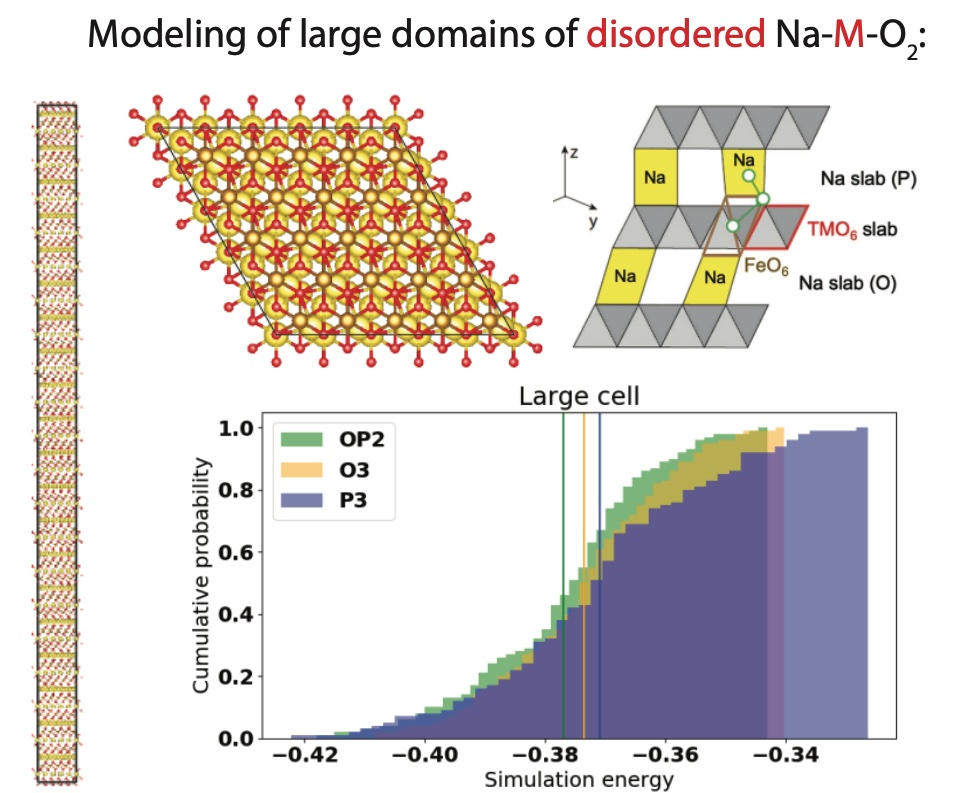
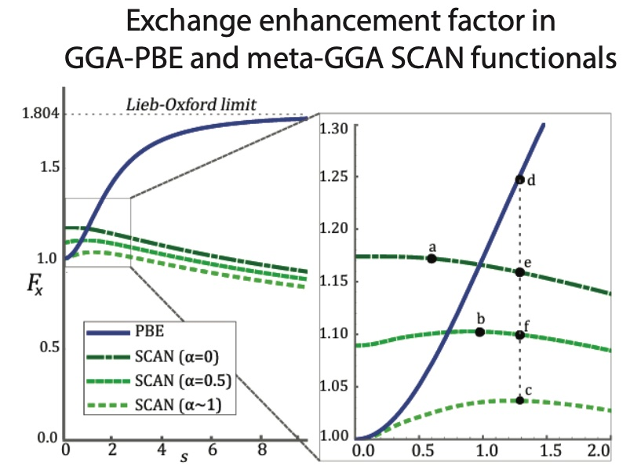

## Research interests \& contributions 
### I. Nano-domain resolution of positive electrodes
> We are interested in understanding atomic-level heterogeneities, occurring either as a single-phase, solid solution or as polycrystals. We use computational tools to isolate the systematic,  thermodynamic effects controlling intragranular and intergranular features.

#### Previous work: 

Using density functional theory (DFT) and random enumeration of large unit-cells (containing ~3000 atoms), we teamed up with an electrochemist and microscopy expert to model the probability of specific, atomic-level interactions of disordered, sodium-ion layered intercalation positive electrodes. Please see our work [here:](https://onlinelibrary.wiley.com/doi/abs/10.1002/aenm.202001151)
 

However, random enumeration cannot capture experimentally-observed phenomena such as short-range order existing at the nano-domain level. 

We have also used DFT and lattice cluster expansion models to study a partially-disordered spinel positive electrode with ultrahigh power and energy density. Our cluster expansion model reveals that a newly-activated pathway for Li hops, through 48f-16d sites, explains the origin of high rate. Please see our work [here:](https://onlinelibrary.wiley.com/doi/abs/10.1002/aenm.202202955)    

### II. Computational methods: understanding and application

> As computational materials scientists, we need to know the utilities and limitations of existing DFT approaches, given that these methods are system-dependent and oftentimes cannot be used "out-of-the-box". In studying complex electrochemical systems and under-explored interfaces, we will need to be sure that our approaches are reliable. 

#### Previous work:
Given the efficacy of meta-GGA functionals in ground state crystal structure prediction, as observed in our work [here](https://www.nature.com/articles/s41524%E2%80%90018%E2%80%900065%E2%80%90z), we used data-driven methods to find systematic under-coordination in the well-known PBE functional, not observed in SCAN. We trace the origin of this difference to their exchange enhancement factors [here](https://journals.aps.org/prb/abstract/10.1103/PhysRevB.100.035132).

We are also the first to study the DFT corrections needed to model organic solvents. (Preprint coming soon.)

### III. Battery recycling with solvents
> Molecular understanding of metal-solvent interactions are essential to develop new metals recycling methods. We are interested in exploiting the tunability of "designer solvents", such as molten salts, ionic liquids, or deep eutectic solvents, to enable selective metals extraction. 

#### Previous work:
We have developed a computational workflow, using cheminformatics and Bayesian methods, to navigate reaction conditions for optimizing chemical recycling of waste plastics. Several patents regarding this process have been filed by X Development LLC. See our primary contribution [here](https://patents.google.com/patent/US20230170056A1/en): 

We also use large-scale atomistic simulations powered by state-of-the-art machine learning methods to understand molecular structure of neat solvent. (Preprint coming soon.)

[Back to home page](index.md)